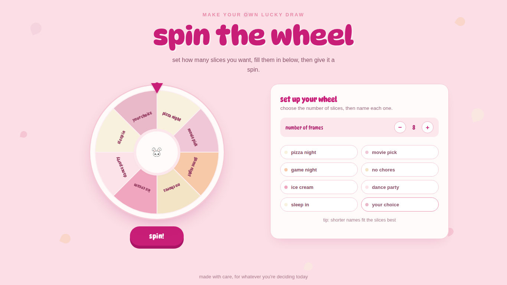
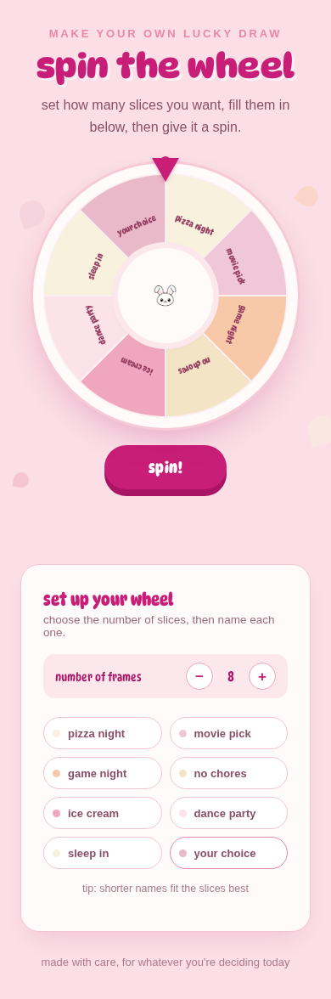
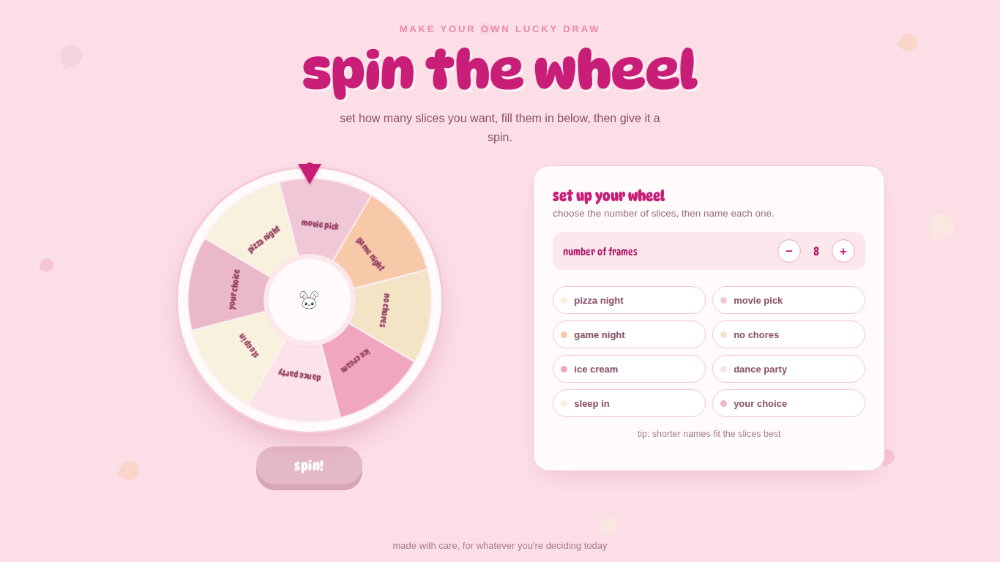

# 🐰 Spin the Wheel

A cute, customizable spin-the-wheel widget built with plain HTML, CSS, and JavaScript — no frameworks, no dependencies, no build step. Set how many slices you want, type in your own prize names, and spin.

**[Live demo →](#)** https://palak-eng.github.io/spin-the-wheel/



## Why I built this

I wanted a lucky-draw / decision-making tool that didn't look like a generic SaaS widget — something soft, playful, and a little bit personal. So I designed the whole visual identity myself (palette, typography, the bunny mascot) and built the wheel logic from scratch in vanilla JS: SVG slice generation, a weighted-free random spin, and rotation math that lands cleanly on a random segment every time.

## Features

- 🎯 **Adjustable slice count** — step from 2 up to 12 slices with a simple +/- control
- ✏️ **Editable labels** — type your own prize, task, or decision into each slice; the wheel updates live as you type
- 🎨 **Custom color palette** — soft pink, cream, and rose tones, color-coded per slice
- 🐰 **Custom mascot** — a hand-drawn bunny sits at the center of the wheel
- 🔤 **Custom typography** — DynaPuff (bold static cut for the heading, self-hosted variable cut at a condensed width everywhere else) for a bouncy, hand-drawn feel
- 📱 **Fully responsive** — works on desktop and mobile without a separate layout
- ⚡ **Zero dependencies** — single HTML file, no npm install, no build tooling

| Desktop | Mobile |
|---|---|
|  |  |

### Mid-spin



## Tech stack

- **HTML5 / CSS3** — layout, animation, responsive design
- **Vanilla JavaScript** — wheel rendering (dynamic SVG), spin physics, state management
- **Self-hosted variable web fonts** — DynaPuff, served locally for reliability (no CDN dependency)

No React, no build step, no package manager required to run it. Open the file, and it works.

## Running it locally

1. Clone the repo
   ```bash
   git clone https://github.com/<your-username>/spin-the-wheel.git
   cd spin-the-wheel
   ```
2. Open `index.html` directly in any browser

   — or, to avoid any local file-permission quirks, serve it:
   ```bash
   python3 -m http.server 8000
   ```
   then visit `http://localhost:8000`

That's it — no install step.

## Project structure

```
spin-the-wheel/
├── index.html              # everything: markup, styles, and logic
├── bunny.png                # mascot image, sits in the wheel's hub
├── dynapuff_bold.ttf         # heading font (static bold cut)
├── dynapuff-wdth.woff2        # body/UI font (variable, condensed width)
└── screenshots/              # images used in this README
```

## How it works

- The wheel is drawn as an SVG generated at runtime — each slice is a calculated arc (`path`) sized to `360° / number of slices`, colored from a fixed palette, and labeled with the text from its matching input.
- Spinning picks a random target slice, then calculates the exact rotation needed to land the pointer on it, adds a few extra full rotations for effect, and animates the rotation with a CSS transition.
- All state (slice count, labels, current rotation) lives in a small JS object — no external state library needed.

## Possible next steps

- [ ] Add sound effects on spin / win
- [ ] Save wheel configurations to local storage so they persist on reload
- [ ] Add a confetti animation on landing
- [ ] Let users pick their own slice colors

## License

MIT — feel free to fork it, remix it, and make it your own.

---

Built with care 🎀 — if you spin it, let me know what it lands on.
